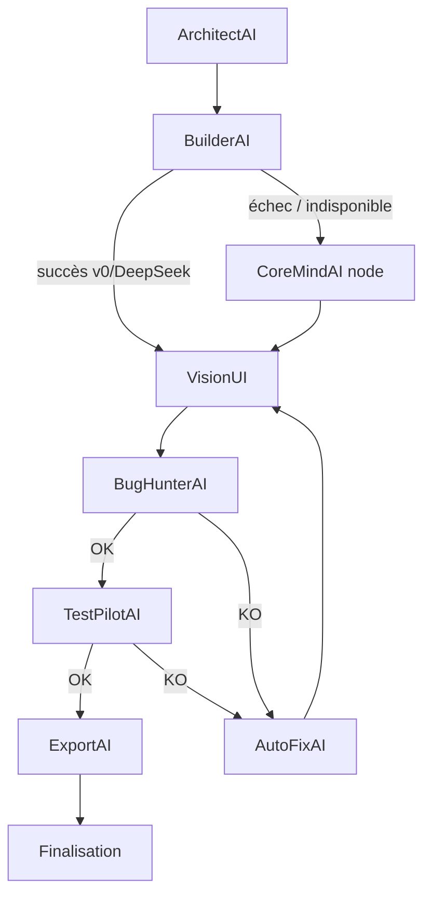

# BuilderAI v1 — Analyse complète de l'architecture de génération de code

> Document de référence avant refonte **BuilderAI v2**.  
> Dernière mise à jour : mai 2026.  
> Aucune modification de code — cartographie de l'existant.

---

## Table des matières

1. [Vue d'ensemble du pipeline](#1-vue-densemble-du-pipeline)
2. [BuilderAI — cœur du système](#2-builderai--cœur-du-système)
3. [Générateurs LLM](#3-générateurs-llm)
4. [CoreMind node — chemins selon generation_mode](#4-coremind-node--chemins-selon-generation_mode)
5. [Templates HTML premium (démos client)](#5-templates-html-premium-démos-client)
6. [Templates Next.js / desktop](#6-templates-nextjs--desktop)
7. [Fallbacks — matrice complète](#7-fallbacks--matrice-complète)
8. [Catalogue des prompts LLM](#8-catalogue-des-prompts-llm)
9. [Validation et post-traitement](#9-validation-et-post-traitement)
10. [API et entrées parallèles](#10-api-et-entrées-parallèles)
11. [Frontend](#11-frontend)
12. [Tests](#12-tests)
13. [Schéma des responsabilités](#13-schéma-des-responsabilités)
14. [Points d'attention pour BuilderAI v2](#14-points-dattention-pour-builderai-v2)
15. [Inventaire exhaustif des fichiers](#15-inventaire-exhaustif-des-fichiers)

---

## 1. Vue d'ensemble du pipeline

Point d'entrée principal : `run_generation_pipeline()` dans `backend/agents/pipeline_graph.py`, appelé par :

- `POST /api/agents/coremind/run` (`backend/api/routes/coremind.py`)
- SSE Générateur (`backend/api/routes/pipeline_stream.py`)

### Graphe LangGraph

```
ArchitectAI → BuilderAI → (CoreMindAI si fallback) → VisionUI → BugHunterAI
    → AutoFixAI (boucles) → TestPilotAI → ExportAI → Finalisation
```



### Point architectural clé

**BuilderAI passe toujours en premier** (tous modes). Les chemins spécialisés de `coremind_node` (templates premium, `real_app`, `vitrine_next`) ne s'activent que si BuilderAI **échoue** (`builder_fallback=True`).

Conséquence : si v0 ou DeepSeek réussit, les chemins nominaux de CoreMind (template premium HTML, scaffold Next.js, app React complète) sont **court-circuités**.

### Constantes pipeline

| Constante | Valeur | Fichier |
|-----------|--------|---------|
| `MAX_AUTOFIX_LOOPS` | 2 | `pipeline_graph.py` |
| `MAX_TESTPILOT_AUTOFIX_LOOPS` | 1 | `pipeline_graph.py` |
| `MAX_FIX_ATTEMPTS` | 3 | `auto_fix_agent.py` |

### Modes de génération (`generation_mode`)

| Mode | Description |
|------|-------------|
| `client_demo` | Défaut — pipeline HTML premium (templates Python + seed LLM) |
| `real_app` | Application React/TypeScript déployable (Railway / Vercel) |
| `vitrine_next` | Site vitrine multi-pages Next.js (scaffold fixe + JSON contenu) |

---

## 2. BuilderAI — cœur du système

### Fichiers principaux

| Fichier | Rôle |
|---------|------|
| `backend/agents/builder_agent.py` | Agent principal : routage v0 vs DeepSeek, enrichissement prompt, post-traitement toolbox |
| `backend/tools/builder_generators.py` | Clients HTTP v0 et DeepSeek Builder |
| `backend/agents/base_agent.py` | Classe de base agents |
| `backend/agents/coremind_agent.py` | Analyse heuristique (type, complexité, outil recommandé) — **sans LLM** |
| `backend/agents/architect_agent.py` | Choix template + pricing ; LLM Haiku optionnel pour affiner le template |
| `backend/agents/vitrine_policy.py` | Politique vitrine HTML (pas de TaskFlow en fallback) |

### Routage BuilderAI

Ordre de décision dans `BuilderAgent.select_provider()` :

1. `CoreMindAnalysis.recommended_tool == DEEPSEEK` → **DeepSeek**
2. Mots-clés backend (`api`, `fastapi`, `postgresql`, …) ou types `API_BACKEND`, `EXTENSION_NAVIGATEUR`, `APPLICATION_DESKTOP`, `APPLICATION_MOBILE` → **DeepSeek**
3. `recommended_tool == V0` → **v0**
4. Complexité `elevee` sans mots-clés UI → **DeepSeek**
5. Mots-clés UI (`react`, `tailwind`, `dashboard`, …) ou types `APPLICATION_WEB`, `LANDING_PAGE`, `SITE_WEB`, `SAAS_DASHBOARD` → **v0**
6. Défaut → **v0**

Regex utilisées : `_UI_KEYWORDS`, `_BACKEND_COMPLEX_KEYWORDS` dans `builder_agent.py`.

### Enrichissement du prompt utilisateur

Concaténation dans `BuilderAgent.build()` :

1. Type + template (ArchitectAI)
2. `CMS_BUILDER_HINT` (`backend/tools/cms_panel_inject.py`)
3. `build_toolbox_builder_context(plan)` (`backend/tools/toolbox_branding.py`) — palette, typo, composants shadcn
4. Prompt utilisateur (+ brief Firecrawl si présent dans le state `inspiration_brief`)

### Post-traitement après génération

- `apply_toolbox_to_generation()` — palette CSS, fonts, `package.json` (`toolbox_branding.py`)
- `preview_html_from_generation()` — re-rendu via template premium si seed présente (`agents/demo_quality.py` → `demo_template_service.py`)

### Reprise vitrine simplifiée (AutoFix)

`build_simplified_vitrine_retry()` dans `builder_agent.py` — ordre de fallback :

1. BuilderAI (v0/DeepSeek) avec `SIMPLIFIED_VITRINE_DIRECTIVE`
2. `CodeGenService.generate_code(..., demo_html=True)`
3. Template **landing** local heuristique (jamais TaskFlow)

Constante `SIMPLIFIED_VITRINE_DIRECTIVE` : HTML vanilla, thème CapCore (`#0D0D0D` / `#C9A84C`), pas de bleu.

---

## 3. Générateurs LLM

| Fichier | Provider | Usage |
|---------|----------|-------|
| `backend/tools/builder_generators.py` | **v0** (Vercel API) | UI React/TSX |
| `backend/tools/builder_generators.py` | **DeepSeek** | Backend / logique complexe |
| `backend/tools/codegen_service.py` | **DeepSeek → Gemini → Claude Sonnet** (+ Haiku si complexité élevée) | Fallback CoreMind, `real_app`, AutoFix, vitrine retry |
| `backend/tools/vitrine/content_agent.py` | CodeGenService (multi-modèle) | JSON contenu vitrine Next.js |
| `backend/agents/architect_agent.py` | **Claude Haiku** (optionnel) | Affinage choix template |
| `backend/routers/firecrawl.py` | **DeepSeek JSON** | Brief inspiration BuilderAI (hors pipeline direct) |
| `backend/tools/replicate_image_gen.py` | Replicate | Images hero (VisionUI, pas code) |

Alias rétrocompat : `backend/tools/claude_service.py` = alias de `CodeGenService`.

### Configuration

- `backend/config.py` — clés API, modèles, timeouts (`v0_*`, `coremind_*`, `builder_*`)
- `backend/security/llm_secrets.py` — résolution coffre chiffré puis variables d'environnement

### Parsing des réponses LLM

- `backend/tools/builder_generators.py` — `_code_from_llm_text()`, extraction JSON ou blocs fenced
- `backend/tools/codegen_service.py` — `_parse_json_response()`, `_to_code_result()`
- `backend/tools/generation_sources.py` — dé-enveloppe JSON tronqué pour sources TSX

---

## 4. CoreMind node — chemins selon generation_mode

Fichier : `backend/agents/pipeline_graph.py` → `coremind_node()`

| Mode | Comportement | Fichiers clés |
|------|--------------|---------------|
| `client_demo` (défaut) | **Pas de HTML LLM** — seed LLM + template premium Python | `demo_template_service.py`, `demo_pipeline.py`, templates premium |
| `real_app` | React/TS complet via CodeGenService + injection Vite | `codegen_service.py`, `_inject_package_json()` dans `pipeline_graph.py` |
| `vitrine_next` | JSON contenu LLM + scaffold Next.js fixe | `tools/vitrine/build.py`, `content_agent.py`, `scaffold_renderer.py`, `templates/vitrine-next/` |

### Injection projet React (`real_app`)

`_inject_package_json()` ajoute si absents :

- `package.json`
- `src/main.tsx`
- `index.html`

Puis fusion toolbox via `_merge_package_json()` si palette définie.

### Politique vitrine HTML

`backend/agents/vitrine_policy.py` — `is_vitrine_html_project()` :

- Types `SITE_WEB`, `LANDING_PAGE`
- Template `landing`
- `pricing_category == "vitrine_next"` (sauf mode `vitrine_next` lui-même)

---

## 5. Templates HTML premium (démos client)

Le LLM **ne génère pas le HTML** en mode `client_demo` nominal. Il produit uniquement une **seed JSON** (`DEMO_SEED_SYSTEM_PROMPT`), puis Python assemble le HTML final.

### Couche façade (ID + marqueur)

| Fichier | Template ID | Marqueur |
|---------|-------------|----------|
| `backend/tools/taskflow_template.py` | `taskflow` | `saas-shell` |
| `backend/tools/landing_template.py` | `landing` | `cf-premium-landing` |
| `backend/tools/crm_template.py` | `crm` | `cf-premium-crm` |
| `backend/tools/dashboard_template.py` | `dashboard` | `cf-premium-dashboard` |
| `backend/tools/facturation_template.py` | `facturation` | `cf-premium-invoice` |

Alias rétrocompat : `invoice` → `facturation`.

### Moteurs HTML (génération réelle)

| Fichier | Rôle |
|---------|------|
| `backend/tools/premium_task_saas_html.py` | TaskFlow SaaS (~800 lignes HTML/CSS/JS) |
| `backend/tools/premium_landing_page_html.py` | Landing vitrine |
| `backend/tools/premium_crm_html.py` | CRM pipeline |
| `backend/tools/premium_dashboard_html.py` | Dashboard KPI |
| `backend/tools/premium_invoice_html.py` | Facturation |
| `backend/tools/premium_reservation_html.py` | Réservations restaurant |
| `backend/tools/premium_base.py` | Base partagée : palettes, footer, marqueurs `cf-preview:v5-premium` |
| `backend/tools/premium_demo_data.py` | Données par défaut (tâches, créneaux…) |
| `backend/tools/premium_seed_context.py` | Contextualisation verticale (marketing, resto, immo…) |
| `backend/tools/premium_theme.py` | CSS thème primary |

### Orchestration seed → HTML

| Fichier | Rôle |
|---------|------|
| `backend/tools/demo_template_service.py` | **Hub central** : détection template, seed LLM/heuristique, `build_html_from_seed()`, validation marqueurs |
| `backend/tools/demo_pipeline.py` | Point d'entrée unique démo → `ClientDemoDocument` |
| `backend/tools/prompt_seed_hints.py` | Extraction signaux métier depuis le prompt |
| `backend/tools/demo_template_gate.py` | Gate mot de passe sur templates |
| `backend/tools/standalone_demo_html.py` | Conversion React→HTML legacy + **TaskFlow fallback standalone** |
| `backend/tools/demo_preview_html.py` | Mockups preview React todo |
| `backend/agents/demo_quality.py` | Pont preview local Générateur |

### Provider / modèle affichés pour templates

```python
TEMPLATE_PROVIDER = "cyberforge"
TEMPLATE_MODEL = "cyberforge-premium"
```

(définis dans `demo_template_service.py`)

---

## 6. Templates Next.js / desktop

| Chemin | Usage |
|--------|-------|
| `templates/vitrine-next/` (~40 fichiers) | Scaffold vitrine multi-pages (Phase 4.2b) — copié par `scaffold_renderer.py` |
| `templates/ecommerce-next/` | E-commerce géré (`managed_ecommerce_service.py`) |
| `templates/site-reservation-next/` | Réservation gérée (`managed_site_reservation_service.py`) |
| `backend/desktop_templates/` | Apps Electron statiques (caisse, facture, lead tracker) |
| `templates/cms-panel/cms-panel.js` | Panneau CMS injecté post-génération |

### Résolution scaffold vitrine

`scaffold_renderer.py` cherche `templates/vitrine-next` depuis plusieurs bases (`__file__`, `cwd`). Fallback : téléchargement GitHub si absent (déploiement Railway depuis sous-dossier).

Contenu injecté : `content/site.json` produit par VitrineContentAI.

---

## 7. Fallbacks — matrice complète

```
Niveau 1 — BuilderAI
  v0 échoue / clé absente → fallback CoreMind node
  DeepSeek échoue → idem

Niveau 2 — CoreMind node (si builder_fallback)
  client_demo → DemoTemplateService (template premium, pas LLM HTML)
  real_app    → CodeGenService multi-modèle
  vitrine_next→ VitrineContentAgent + scaffold local/GitHub

Niveau 3 — BugHunterAI rejette le HTML
  AutoFixAI : jusqu'à 3 tentatives CodeGen demo_html=True
  Codes critiques (visible_source, broken_js, render_error, empty_elements)
    → fallback immédiat sans régénération LLM

Niveau 4 — AutoFix épuisé
  Vitrine HTML (site_web, landing, template landing) :
    → build_simplified_vitrine_retry (v0/DeepSeek → CodeGen → landing local)
  Autres projets :
    → build_task_manager_standalone_html (TaskFlow premium)

Niveau 5 — Template/scaffold introuvable
  vitrine-next : téléchargement GitHub (scaffold_renderer.py)
  site-reservation / ecommerce : fallback inline minimal (managed_*_service.py)
```

### Fichiers impliqués dans les fallbacks

| Fichier | Rôle fallback |
|---------|---------------|
| `backend/agents/auto_fix_agent.py` | Orchestration AutoFix, `_resolve_fallback()`, TaskFlow vs vitrine |
| `backend/agents/builder_agent.py` | `build_simplified_vitrine_retry()` |
| `backend/tools/standalone_demo_html.py` | `build_task_manager_standalone_html()` |
| `backend/tools/demo_template_service.py` | `heuristic_demo_seed()`, template landing local |

### Constantes AutoFix

```python
TASKFLOW_FALLBACK_MODEL = "taskflow-premium"
TASKFLOW_FALLBACK_PROVIDER = "cyberforge"
_IMMEDIATE_TASKFLOW_CODES = {"visible_source", "broken_js", "render_error", "empty_elements"}
```

---

## 8. Catalogue des prompts LLM

### BuilderAI (`builder_generators.py`)

#### `BUILDER_V0_SYSTEM`

- Modèle : v0 (config `V0_MODEL`, défaut `v0-1.5-md`)
- Sortie : JSON `{summary, code, files, stack}` ou bloc TSX fenced
- Fichier principal attendu : `src/App.tsx`

#### `BUILDER_DEEPSEEK_SYSTEM`

- Modèle : DeepSeek (`coremind_deepseek_model`)
- Sortie : JSON TypeScript/Python/API
- Fichier principal attendu : `src/main.ts`

### CodeGenService (`codegen_service.py`)

#### `CODEGEN_SYSTEM_PROMPT`

- Mode : application React
- Contraintes : un seul fichier `src/App.tsx`, ≤ 120 lignes, pas de dépendances externes
- Sortie : JSON compact uniquement

#### `CODEGEN_DEMO_HTML_PROMPT`

- Mode : démo HTML vanilla (`demo_html=True`)
- Interdictions explicites : React, JSX, Tailwind classes, `className`, hooks
- Contraintes : `index.html` complet, ≤ 200 lignes, thème sombre cyber violet/cyan
- Sortie : JSON compact uniquement

#### `DEMO_SEED_SYSTEM_PROMPT`

- Mode : seed uniquement — **aucun HTML**
- Templates disponibles : `taskflow`, `landing`, `crm`, `dashboard`, `facturation`, `reservation`
- Sortie : JSON `{template, title, subtitle, brand_name, brand_tag, user_name, user_role, tasks[]}`

Routage providers dans `_generation_specs()` :

```
DeepSeek → Gemini → Claude Sonnet
+ Haiku si complexité elevee
```

Limite prompt : `MAX_USER_PROMPT_CHARS = 2500` (troncature avec suffixe).

### BuilderAI vitrine retry (`builder_agent.py`)

#### `SIMPLIFIED_VITRINE_DIRECTIVE`

- HTML vanilla autonome, structure header/hero/services/contact
- Thème CapCore : fond `#0D0D0D`, accents `#C9A84C`, aucune teinte bleue
- Minimum 20 règles CSS

### AutoFixAI (`auto_fix_agent.py`)

#### `_build_fix_prompt()`

Construit dynamiquement :

- Prompt utilisateur original
- Rapport BugHunter (codes + messages, max 12 issues)
- Consignes HTML vanilla strictes (`<!DOCTYPE html>`, `<style>` ≥ 15 règles, pas de React/JSX)

### VitrineContentAI (`vitrine/content_agent.py`)

#### `VITRINE_CONTENT_SYSTEM`

- Sortie : JSON `site.json` multi-pages (meta, navigation, home, servicesPage, contactPage, footer)
- Règles images : `imageQuery` EN 3–6 mots, placeholder Unsplash
- Ton professionnel, local, français — pas de lorem ipsum

### ArchitectAI (`architect_agent.py`)

#### `_llm_refine()` (Claude Haiku, optionnel)

System :

```
Tu es ArchitectAI pour CyberForge. Réponds UNIQUEMENT en JSON valide, sans markdown.
Champs requis : template (un parmi …), rationale (français, 1-2 phrases).
Le project_type est déjà fixé par l'analyseur — ne le modifie pas.
```

User : `project_type_label`, `complexity`, prompt tronqué à 6000 chars.

Fallback si échec LLM : heuristiques `detect_template_from_prompt()`.

### Firecrawl inspiration (`routers/firecrawl.py`)

| Endpoint | Prompt |
|----------|--------|
| `POST /firecrawl/analyze-competitor` | DeepSeek UX/conversion → JSON `{analyse, points_forts, points_faibles, suggestions, composants_recommandes}` |
| `POST /firecrawl/clone-inspiration` | Brief markdown BuilderAI via `_build_brief_builder()` (heuristique + scrape, pas LLM direct) |

Le brief alimente `inspiration_brief` dans `PipelineState`, fusionné dans le prompt Architect via `_architect_input_prompt()`.

### Enrichissement prompt (blocs injectés, non-system)

| Source | Fichier | Contenu |
|--------|---------|---------|
| `CMS_BUILDER_HINT` | `cms_panel_inject.py` | Marqueurs `data-cms` pour panneau éditorial |
| `build_toolbox_builder_context()` | `toolbox_branding.py` | Palette, typo Google Fonts, composants shadcn |
| `build_toolbox_content_agent_block()` | `toolbox_branding.py` | Variante pour VitrineContentAI |
| Prompt enrichi pipeline | `pipeline_graph.py` | `Type de projet`, `Template premium : …` |

---

## 9. Validation et post-traitement

Ces composants ne génèrent pas de code mais transforment ou valident le livrable.

| Fichier | Rôle |
|---------|------|
| `backend/agents/bug_hunter_agent.py` | Heuristiques HTML (React visible, JS cassé, taille, marqueurs…) |
| `backend/agents/testpilot_agent.py` | Validation finale (liens, scripts, syntaxe) — **pas de LLM** |
| `backend/agents/visionui_agent.py` | Enrichissement images toolbox + screenshot Replicate/local |
| `backend/tools/vision_toolbox_enricher.py` | Injection photos/icons dans HTML |
| `backend/tools/vision_local_preview.py` | Aperçu local sans Replicate |
| `backend/tools/replicate_screenshot.py` | Capture screenshot via Replicate |
| `backend/tools/replicate_image_gen.py` | Génération images hero |
| `backend/tools/generation_sources.py` | Dé-enveloppe JSON LLM tronqué |
| `backend/tools/palette_apply.py` | Application palette sur HTML |
| `backend/tools/theme_enforce.py` | Thème CapCore forcé (post-export projets CapCore) |
| `backend/tools/tailwind_inline.py` | Utilitaires CSS inline |
| `backend/tools/cms_panel_inject.py` | Injection panneau CMS dans `<head>` |
| `backend/tools/cms_markup.py` | Annotation `data-cms` automatique |

### Boucles de validation

```
BugHunter KO → AutoFix (max 2 boucles pipeline) → VisionUI → BugHunter
TestPilot KO → AutoFix (max 1 boucle) → VisionUI → …
```

---

## 10. API et entrées parallèles

| Route / fichier | Génération |
|-----------------|------------|
| `POST /agents/coremind/run` | Pipeline complet LangGraph |
| `GET /api/pipeline/stream` | Idem + SSE événements agents |
| `POST /agents/coremind` | Analyse CoreMind seule (heuristique) |
| `POST /agents/coremind/generate` | CodeGenService direct (sans pipeline) |
| `POST /agents/coremind/preview-html` | Re-render template depuis seed JSON |
| `backend/api/routes/demos.py` | Pipeline démo standalone → Cloudflare (bypass LangGraph) |
| `backend/routers/firecrawl.py` | Brief inspiration (alimente pipeline) |
| `backend/routers/toolbox.py` | Secteurs/palettes (contexte Architect) |
| `backend/scripts/redeploy_capcore_pro_site.py` | Script manuel regénération CapCore |

### Persistance post-génération (hors scope génération, lié au pipeline)

- `backend/tools/export_demo_persistence.py` — ligne `demos` Supabase après export
- `backend/agents/export_agent.py` — déploiement Cloudflare Pages / Railway

---

## 11. Frontend

| Fichier | Rôle |
|---------|------|
| `frontend/src/pages/GeneratorPage.tsx` | UI Générateur, envoi `generation_mode`, SSE |
| `frontend/src/lib/pipeline-stream.ts` | Client SSE, gestion erreurs |
| `frontend/src/components/PipelineProgress.tsx` | Étapes agents (labels friendly) |
| `frontend/src/context/AgentsStatusContext.tsx` | Statut BuilderAI, CoreMindAI… |
| `frontend/src/context/PipelineActivityContext.tsx` | Activité pipeline en cours |
| `frontend/src/context/GeneratorSessionContext.tsx` | État session générateur |
| `shared/types.ts` | Types `generation_mode`, projets perso, URLs production |

---

## 12. Tests

| Fichier | Couvre |
|---------|--------|
| `backend/tests/test_builder_agent.py` | Routage v0/DeepSeek, fallback CoreMind |
| `backend/tests/test_codegen_service.py` | Prompts, parsing JSON, providers |
| `backend/tests/test_demo_template_service.py` | Seeds, templates, détection |
| `backend/tests/test_demo_pipeline.py` | Pipeline démo end-to-end |
| `backend/tests/test_demo_quality.py` | Preview HTML |
| `backend/tests/test_auto_fix_agent.py` | Fallbacks vitrine vs TaskFlow |
| `backend/tests/test_vitrine_policy.py` | Politique vitrine HTML |
| `backend/tests/test_pipeline_graph.py` | Graphe LangGraph, nœuds |
| `backend/tests/test_architect_agent.py` | Architect + templates |
| `backend/tests/test_architect_pricing.py` | Tarification Architect |
| `backend/tests/test_architect_toolbox.py` | Intégration toolbox |
| `backend/tests/test_standalone_demo_html.py` | TaskFlow standalone |
| `backend/tests/test_demo_templates_gate.py` | Gate mot de passe |
| `backend/tests/test_demo_preview_html.py` | Mockups preview |
| `backend/tests/test_visionui_agent.py` | VisionUI |
| `backend/tests/test_bug_hunter_agent.py` | BugHunter heuristiques |

---

## 13. Schéma des responsabilités

```
┌─────────────────────────────────────────────────────────────┐
│                    GÉNÉRATION DE CODE                        │
├──────────────────┬──────────────────────────────────────────┤
│ LLM direct       │ v0, DeepSeek Builder, CodeGen multi-LLM  │
│ LLM seed only    │ DEMO_SEED_SYSTEM → données template      │
│ LLM contenu JSON │ VitrineContentAI → site.json             │
│ Templates Python │ premium_*_html.py (HTML final)           │
│ Scaffold copié   │ templates/vitrine-next, ecommerce, etc.  │
│ Heuristiques     │ CoreMindAgent, ArchitectAgent, seeds     │
└──────────────────┴──────────────────────────────────────────┘
```

### Flux nominal par mode (si BuilderAI échoue)

| Mode | Chemin nominal CoreMind |
|------|-------------------------|
| `client_demo` | Seed LLM → `build_html_from_seed()` → template premium |
| `real_app` | CodeGen React → toolbox → injection Vite |
| `vitrine_next` | VitrineContentAI → copie scaffold → `content/site.json` |

### Flux si BuilderAI réussit (tous modes)

```
BuilderAI (v0/DeepSeek) → apply_toolbox → preview_html_from_generation
  → VisionUI → BugHunter → …
```

Le contenu produit dépend du provider (souvent React/TSX), pas du mode sélectionné.

---

## 14. Points d'attention pour BuilderAI v2

### 1. Double chemin ambigu

BuilderAI (v0 React) peut réussir et **court-circuiter** les chemins `real_app`, `vitrine_next` et templates premium de CoreMind. Le mode « nominal » démo client passe souvent par **fallback** Builder → CoreMind template.

**Piste v2** : routage explicite par `generation_mode` avant ou à la place du fallback implicite.

### 2. Trois stratégies HTML coexistent

| Stratégie | Mécanisme |
|-----------|-----------|
| LLM HTML vanilla | `CODEGEN_DEMO_HTML_PROMPT` (AutoFix, vitrine retry) |
| Templates Python | `premium_*_html.py` (~6000+ lignes cumulées) |
| Conversion legacy | `standalone_demo_html.py` (React todo → HTML) |

**Piste v2** : unifier ou documenter clairement quand chaque stratégie s'applique.

### 3. Prompts dispersés

6+ fichiers sans registre central — difficile à versionner, tester et auditer.

**Piste v2** : module `prompts/` ou registre versionné avec tests snapshot.

### 4. TaskFlow reste le repli universel

Sauf vitrines HTML (`vitrine_policy.py`), l'échec AutoFix produit TaskFlow — source fréquente du message utilisateur « échec après 3 tentatives ».

**Piste v2** : replis alignés sur le template choisi par ArchitectAI, pas systématiquement TaskFlow.

### 5. Écart preview vs livrable

`preview_html_from_generation()` peut re-rendre via template premium même quand le LLM a produit autre chose — écart possible entre `generation.code` et `preview_html`.

**Piste v2** : source de vérité unique pour le HTML livré.

### 6. ArchitectAI hybride

Heuristiques par défaut + Haiku optionnel pour template — deux chemins de décision.

**Piste v2** : décision template déterministe ou entièrement LLM, pas les deux en parallèle opaque.

---

## 15. Inventaire exhaustif des fichiers

### Agents pipeline

```
backend/agents/pipeline_graph.py
backend/agents/builder_agent.py
backend/agents/architect_agent.py
backend/agents/architect_pricing.py
backend/agents/coremind_agent.py
backend/agents/auto_fix_agent.py
backend/agents/bug_hunter_agent.py
backend/agents/testpilot_agent.py
backend/agents/visionui_agent.py
backend/agents/export_agent.py          # déploiement, pas génération
backend/agents/demo_quality.py
backend/agents/vitrine_policy.py
backend/agents/base_agent.py
```

### Générateurs et services LLM

```
backend/tools/builder_generators.py
backend/tools/codegen_service.py
backend/tools/claude_service.py
backend/cockpit_connectors/deepseek.py
backend/tools/vitrine/content_agent.py
```

### Templates et pipeline démo

```
backend/tools/demo_template_service.py
backend/tools/demo_pipeline.py
backend/tools/demo_template_gate.py
backend/tools/standalone_demo_html.py
backend/tools/demo_preview_html.py
backend/tools/taskflow_template.py
backend/tools/landing_template.py
backend/tools/crm_template.py
backend/tools/dashboard_template.py
backend/tools/facturation_template.py
backend/tools/premium_base.py
backend/tools/premium_task_saas_html.py
backend/tools/premium_landing_page_html.py
backend/tools/premium_crm_html.py
backend/tools/premium_dashboard_html.py
backend/tools/premium_invoice_html.py
backend/tools/premium_reservation_html.py
backend/tools/premium_demo_data.py
backend/tools/premium_seed_context.py
backend/tools/premium_theme.py
backend/tools/prompt_seed_hints.py
```

### Vitrine Next.js

```
backend/tools/vitrine/build.py
backend/tools/vitrine/scaffold_renderer.py
backend/tools/vitrine/content_schema.py
backend/tools/vitrine/unsplash_resolver.py
backend/tools/vitrine/__init__.py
templates/vitrine-next/**                 # ~40 fichiers scaffold Next.js
```

### Post-traitement génération

```
backend/tools/toolbox_branding.py
backend/tools/generation_sources.py
backend/tools/cms_panel_inject.py
backend/tools/cms_markup.py
backend/tools/palette_apply.py
backend/tools/theme_enforce.py
backend/tools/tailwind_inline.py
backend/tools/vision_toolbox_enricher.py
backend/tools/vision_local_preview.py
backend/tools/replicate_screenshot.py
backend/tools/replicate_image_gen.py
```

### Managed / desktop (templates statiques)

```
backend/tools/managed_ecommerce_service.py
backend/tools/managed_site_reservation_service.py
templates/ecommerce-next/**
templates/site-reservation-next/**
backend/desktop_templates/**
templates/cms-panel/cms-panel.js
```

### API et configuration

```
backend/api/routes/coremind.py
backend/api/routes/pipeline_stream.py
backend/api/routes/demos.py
backend/api/routes/agents_status.py
backend/routers/firecrawl.py
backend/routers/toolbox.py
backend/config.py
backend/security/llm_secrets.py
backend/scripts/redeploy_capcore_pro_site.py
```

### Frontend

```
frontend/src/pages/GeneratorPage.tsx
frontend/src/lib/pipeline-stream.ts
frontend/src/components/PipelineProgress.tsx
frontend/src/context/AgentsStatusContext.tsx
frontend/src/context/PipelineActivityContext.tsx
frontend/src/context/GeneratorSessionContext.tsx
shared/types.ts
```

---

## Annexe — Labels agents pipeline

Définis dans `pipeline_graph.py` → `AGENT_LABELS` :

| ID | Label UI |
|----|----------|
| `architect` | ArchitectAI |
| `builder` | BuilderAI |
| `coremind` | CoreMindAI |
| `visionui` | VisionUI |
| `bughunter` | BugHunterAI |
| `autofix` | AutoFixAI |
| `testpilot` | TestPilotAI |
| `export` | ExportAI |
| `finalize` | Finalisation |

---

*Document généré pour la refonte BuilderAI v2 — CyberForge / CapCore.*
