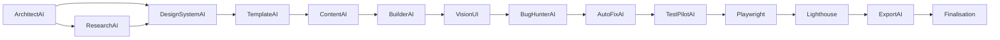

# CyberForge — Architecture template-first (refonte)

> Principe fondamental : **chaque agent a une seule responsabilité**. Résultat structuré ou erreur explicite. Jamais de succès partiel silencieux.

## Problème résolu

| Avant | Après |
|-------|--------|
| BuilderAI (v0/DeepSeek) génère du HTML from scratch | **TemplateEngine** assemble un gabarit validé |
| Contenu générique, prompt dans le `<title>` | **Slots** remplis (nom, secteur, ville) + shell vitrine |
| Fallback CoreMind seulement si Builder échoue | **Template-first en premier** pour `client_demo` et vitrines |

## Couches

```
┌─────────────────────────────────────────────────────────────┐
│  UI Electron / GeneratorPage / API pipeline_stream          │
└────────────────────────────┬────────────────────────────────┘
                             ▼
┌─────────────────────────────────────────────────────────────┐
│  LangGraph pipeline (pipeline_graph.py)                     │
│  Vitrine : Architect → DesignSystem → Template → Research* → Content → Builder → … │
└────────────────────────────┬────────────────────────────────┘
                             ▼
┌─────────────────────────────────────────────────────────────┐
│  BuilderAI (builder_agent.py)                               │
│  SI client_demo / vitrine → TemplateFirstBuilder          │
│  SINON → v0 / DeepSeek (real_app, backends)                 │
└──────────────┬─────────────────────────────┬────────────────┘
               ▼                             ▼
   ┌───────────────────────┐     ┌────────────────────────────┐
   │ core/template_registry │     │ tools/builder_generators   │
   │ core/template_engine   │     │ (LLM autorisé)             │
   └───────────────────────┘     └────────────────────────────┘
```

## Catalogue templates (`core/template_registry.py`)

| ID | render_kind | Mode | Rôle |
|----|-------------|------|------|
| `landing` | `vitrine_shell` | client_demo | Vitrine HTML (navbar, hero, services, contact) |
| `taskflow`, `crm`, `dashboard`, `facturation`, `reservation` | `html_seed` | client_demo | Templates Python existants + seed |
| `vitrine_next` | `next_scaffold` | vitrine_next | Scaffold Next (pipeline CoreMind) |
| `real_app` | `react_scaffold` | real_app | LLM autorisé |

## Contrats agents (`core/agent_contract.py`)

```python
result: AgentResult[T]
  status: success | failure
  data: T | None      # obligatoire si success
  error: AgentFailure # obligatoire si failure
```

Utilitaire : `require_ok(result)` lève `AgentContractError`.

## Responsabilités agents (non négociables)

| Agent | Responsabilité unique | Interdit |
|-------|----------------------|----------|
| **DesignSystemAI** | JSON tokens visuels complets avant code | HTML, copy, structure |
| **ArchitectAI** | Choisir `project_type` + `template_id` du catalogue | Inventer un template hors catalogue |
| **ResearchAI** | Brief structuré (nom, secteur, ville, mots-clés) | Générer du HTML |
| **BuilderAI / TemplateFirst** | Rendre le livrable depuis le template | HTML libre en client_demo |
| **VisionUI** | Médias / capture | Modifier le contenu métier |
| **BugHunterAI** | Valider HTML ; réparer identité client | Régénérer tout le site |
| **AutoFixAI** | Corriger défauts (max 2 boucles) | Boucler indéfiniment |
| **TestPilot / Playwright / Lighthouse** | Tests qualité | Déployer |
| **ExportAI** | Publier + **gate mot de passe** (livraison finale) | Gate sur preview |

## Pipeline LangGraph — ordre vitrine (`client_demo`, `vitrine_next`)

\* = optionnel (config / flags pipeline)



| # | Nœud | State clé | Rôle |
|---|------|-----------|------|
| 1 | **ArchitectAI** | `architect_plan` | Type projet + template catalogue |
| 2 | **ResearchAI** * | `research_brief` | Mots-clés, tendances, contexte marché |
| 3 | **DesignSystemAI** | `design_system` · nœud `design_system_ai` | JSON loi visuelle (couleurs, polices) |
| 4 | **TemplateAI** | `sector_template.html_raw` | Fichier sectoriel + `{{placeholders}}` |
| 5 | **ContentAI** | `sector_template.html` | Placeholders → contenu client réel |
| 6 | **BuilderAI** | `generation`, `preview_html` | Assemblage + optimise HTML |
| 7+ | VisionUI → BugHunter → TestPilot → Playwright → Lighthouse → Export | — | Qualité, export, livraison |

**Types template-first (HTML assemblé)** : vitrines, `ecommerce_*`, `reservation_*`, `app_*`, `desktop_*` — voir `tools/sector_template_catalog.py`.

**BuilderAI v2** : `assemble_template_html()` — pas de HTML from scratch (sauf `real_app` React/TS).

## Flux technique (template-first)

1. `ResearchAI` enrichit le contexte (si activé)
2. `DesignSystemAI` fixe la loi visuelle
3. `TemplateAI` charge `backend/templates/sectors/*.html`
4. `ContentAI` remplit avec `research_brief` + `design_system`
5. `BuilderAI` valide/minifie le HTML final (`optimize_html`)
6. Pas de HTML généré from scratch sur ces modes

## Fichiers clés

| Fichier | Rôle |
|---------|------|
| `core/agent_contract.py` | Enveloppes succès/échec |
| `core/template_registry.py` | Catalogue |
| `core/template_engine.py` | Rendu HTML |
| `agents/template_first_service.py` | Orchestration Builder |
| `agents/builder_agent.py` | Routage template-first vs LLM |
| `tools/vitrine_shell.py` | Design vitrine premium |
| `tools/client_content_profile.py` | Identité client littérale |

## Évolutions prévues (phases)

1. **Phase 1 (actuelle)** — Template-first vitrine + html_seed ; contrats ; doc
2. **Phase 2** — `ContentAgent` : LLM remplit uniquement JSON de slots (copy), jamais HTML
3. **Phase 3** — Directives YAML par agent chargées au démarrage ; tests contractuels CI
4. **Phase 4** — Frontend : afficher template_id + statut agent dans le Générateur

## Tests

```bash
cd backend
.venv/Scripts/python.exe -m pytest tests/test_template_first.py -q
```
